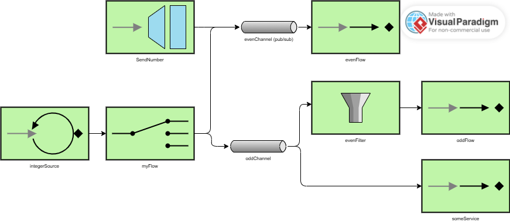

# Lab 5 Integration and SOA - Project Report

## 1. EIP Diagram (Before)

El código inicial empieza generando un numero entero que incrementa a cada ciclo. Este numero se le pasa a myFlow, que se encarga de mandarlo a un canal u otro dependiendo de si este entero es par o impar. Si es par, se manda al canal evenChannel, y si es impar al oddChannel. Luego, tabien está la funcion SendNumber, que genera un número negativo aleatorio y lo manda al canal evenChannel.

El canal evenChannel, es de tipo Publicación/Suscripción, con el servicio evenFlow como suscriptor. Este servicio se encarga de recibir los números del canal, e imprimirlos en consola.

Por otro lado, el canal OddChannel envía los numeros que recibe a un servicio llamado oddFlow, que se encarga de recibir los números del canal, filtrar los que sean pares (que no son ninguno de los que le llegan, por lo cual deniega todos los que le llegan) y imprimirlos en consola (cosa que no llega a ocurrir). Tambien tiene otro servicio llamado someService, que se encarga de recibir los números del canal e imprime en consola el dato con su tipo.

## 2. What Was Wrong

Explain the bugs you found in the starter code:

- **Bug 1**: El filtro evenFilter previo a oddFlow solo permite el paso de numeros impares, cuando por ese canalo solo pueden llegar numeros impares. Por lo tanto, ningun numero llega a imprimirse en consola. Para arreglarlo, he eliminado el filtro evenFilter.
- **Bug 2**: El sendNumber se manda automaticamente al canal evenChannel, sienfo asi tratados numeros impares en el canal de pares. Para arreglarlo, he creado un nuevo canal llamado numberChannel, y he modificado sendNumber para que envie los numeros a este nuevo canal. Luego, he conectado este canal a myFlow un, que se encarga de recibir los numeros y enviarlos al canal oddChannel si son impares, o al canal evenChannel si son pares. Para ajustar eso correctamente, tambien he conectado integerSource al canal numberChannel, para que sea este canal el que se encarge de pasarle los numeros a myFlow.
- **Bug 3**: Siendo el canal oddChannel el que más servicios tiene que ejecutar, y el even channel el que menos, se ha decidido cambiar su comportamiento, pasando evenChannel a ser un canal común y oddChannel a ser del tipo Publicación/Suscripción.

## 3. What You Learned

Gracias a los Enterprise Integration Patterns, me ha resultado mucho más sencillo comprender el funcionamiento del programa, lo que me ha hecho ver la forma en la que facilita la comprensión de un código, y la facilidad para luego modificarlo a tu antojo. A esto se le puede añadir tambien la facilidad con la que luego puedo compartir mi conocimiento de un sistema con otra persona.

Spring Integration nos sirve para transformar esos patrones que podemos ver con EIP en código, en fragmentos de código que se pueden interconectar entre sí, dando estructura a este y simplificandolo, volviendose una traduccion del esquema a código.

Al principio me ha costado ver realmente qué tipo de elemento era cada uno en el código, pero una vez visto el funcionamiento de Spring Integration, traducirlo en un esquema se hace muy sencillo. Para reestructurar el código, una vez detectados los elementos que conforman los canales, vuelve a ser sencillo rehacer correctamente las conexiones.

## 4. AI Disclosure

**Did you use AI tools?** No AI tools were used.
